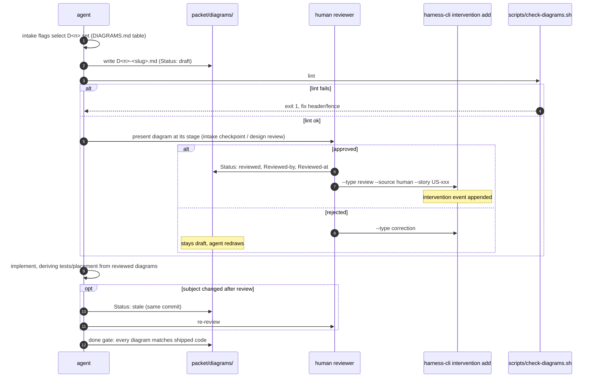

# D3 Sequence — US-037 Change diagrams: review flow

Story: US-037
Kind: sequence
Source: hand
Scope: intake flags → diagram files → human review → intervention record → done gate
Status: draft
Reviewed-by: -
Reviewed-at: -

## What to review

- Is the review recorded in both places (file header and intervention) and is
  the intervention the one that wins on disagreement?
- Is `stale` set by the agent that changes the subject, in the same commit?
- Does a rejection leave the file `draft` rather than deleting it?

## Derived next steps

- Lint test: wrong Kind / `reviewed` without reviewer fields → exit 1 (covered by `scripts/check-diagrams.sh`).
- Done-gate check: every required diagram `reviewed` — manual until `story verify` can require it.
