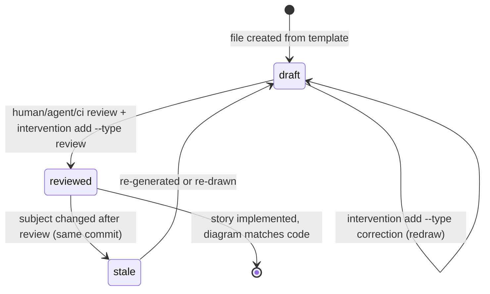

# D4 State — US-037 Change diagram status set

Story: US-037
Kind: state
Source: hand
Scope: the Status field of a change-diagram file
Status: reviewed
Reviewed-by: human:thanh-dong
Reviewed-at: 2026-08-23

## What to review

- Forbidden transitions: `stale --> reviewed` (must pass through `draft` and a
  new review); `draft --> [*]` for a required diagram (done with an unreviewed
  diagram).
- Is `reviewed` the only state that allows done?

## Derived next steps

- Lint accepts only `draft | reviewed | stale` (covered).
- `reviewed` requires `Reviewed-by` and `Reviewed-at` (covered).
