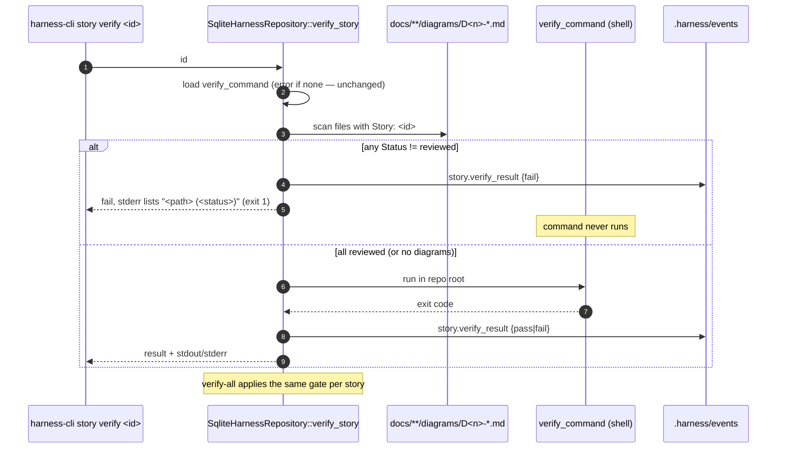

# D3 Sequence — US-038 story verify diagram gate

Story: US-038
Kind: sequence
Source: hand
Scope: harness-cli story verify <id> → docs/**/diagrams scan → verify_command → story.verify_result event
Status: draft
Reviewed-by: -
Reviewed-at: -

## What to review

- Is "any diagram file naming this story that is not `reviewed`" the right gate, rather than only flag-required ones? (Chosen: if you drew it, it must be reviewed or deleted.)
- Should the gate record a `fail` event? (Chosen: yes — `last_verified_result` must reflect that verify did not pass.)
- Template files (`Story: US-XXX`) can never match a real id, so they never gate.

## Derived next steps

- Unit test: scan finds only matching story + non-reviewed status, ignores non-`diagrams/` dirs.
- Integration test: gated verify does not run the command, records fail; reviewed → runs and passes.
