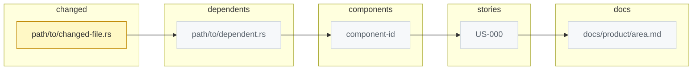

# D1 Blast radius — US-XXX Story title

Story: US-XXX
Kind: blast-radius
Source: generated:codegraph
Scope: files changed by this story and everything that depends on them
Coverage: 0 of 0
Status: draft
Reviewed-by: -
Reviewed-at: -

## What to review

- Is every node in `changed` inside the approved scope?
- Is any dependent, component, or story here that the request did not mention?
- Coverage below half means feature impact is UNKNOWN — read the product docs
  by hand before approving.

## Derived next steps

- Re-run set: `scripts/bin/harness-cli story verify <id>` for every story node.
- Reading list: every component and doc node, before implementation.
- Flags answered from this diagram: Existing behavior, Multi-domain, Public contracts.
