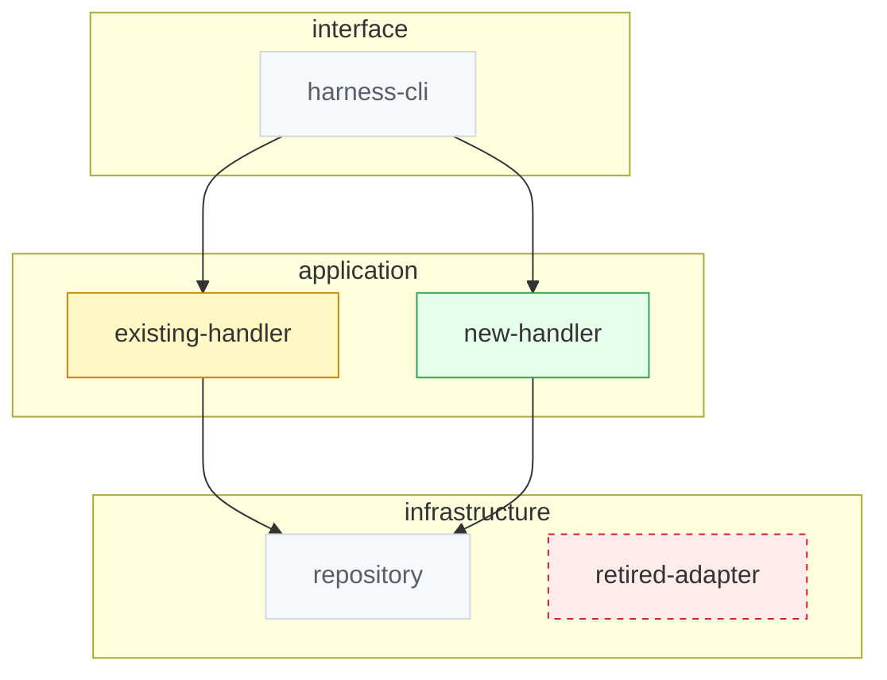

# D2 Component delta — US-XXX Story title

Story: US-XXX
Kind: component-delta
Source: generated:c3
Scope: containers and components this story adds, changes, or removes
Status: draft
Reviewed-by: -
Reviewed-at: -

## What to review

- Does the direction match `docs/ARCHITECTURE.md` layering (domain <- application <- infrastructure <- interface)?
- Is any `added` node a new boundary that needs a decision record?
- Is every `removed` node orphaned by this change, not pre-existing dead code?

## Derived next steps

- File placement per layer for each `added` / `changed` node.
- Design Notes / Harness Delta section entries.
