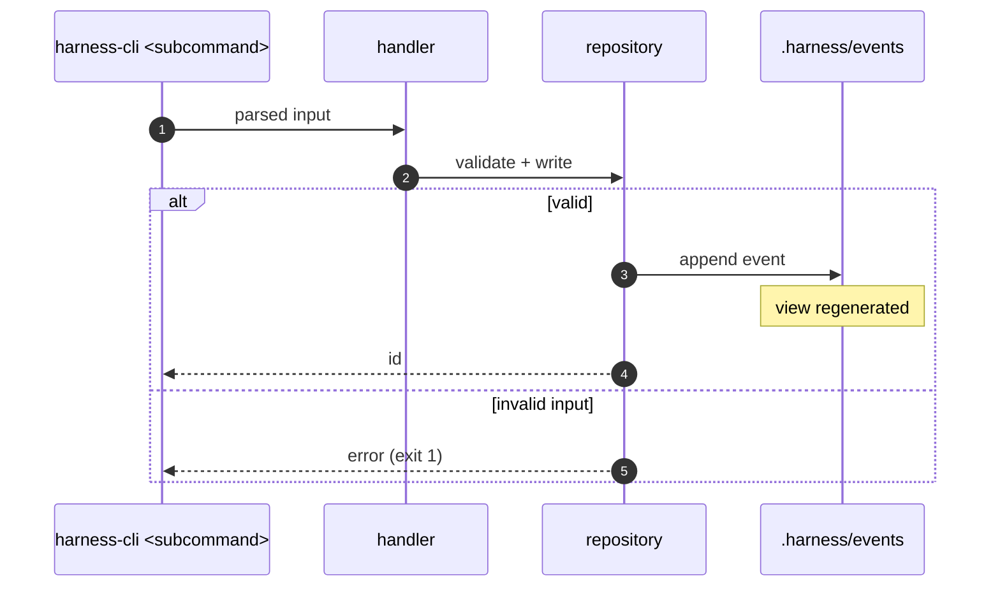

# D3 Sequence — US-XXX Story title

Story: US-XXX
Kind: sequence
Source: hand
Scope: <command or entry point> → <handler> → <storage> → <side effects>
Status: draft
Reviewed-by: -
Reviewed-at: -

## What to review

- Does the happy path match the product contract?
- Is every error path the code can hit drawn as an `alt` / `else`?
- Are all side effects (events, generated views, files) shown as Notes?

## Derived next steps

- One integration or E2E case per `alt` / `opt` branch, listed in the validation plan before implementation.
- DTO / argument shapes for the interface contract.
