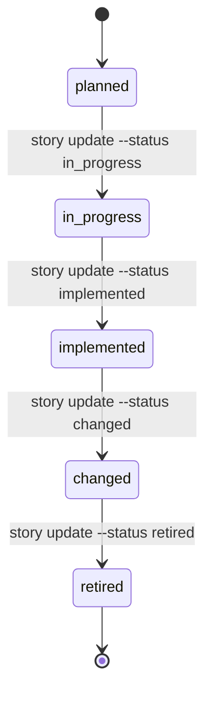

# D4 State — US-XXX Story title

Story: US-XXX
Kind: state
Source: hand
Scope: <entity> status set
Status: draft
Reviewed-by: -
Reviewed-at: -

## What to review

- Forbidden transitions: list each one (e.g. `retired --> planned`).
- Is every state reachable and is there a terminal state?
- Does each transition name the command or event that causes it?

## Derived next steps

- Invariant test per forbidden transition.
- `CHECK` constraint or accepted-value list matching the state set.
