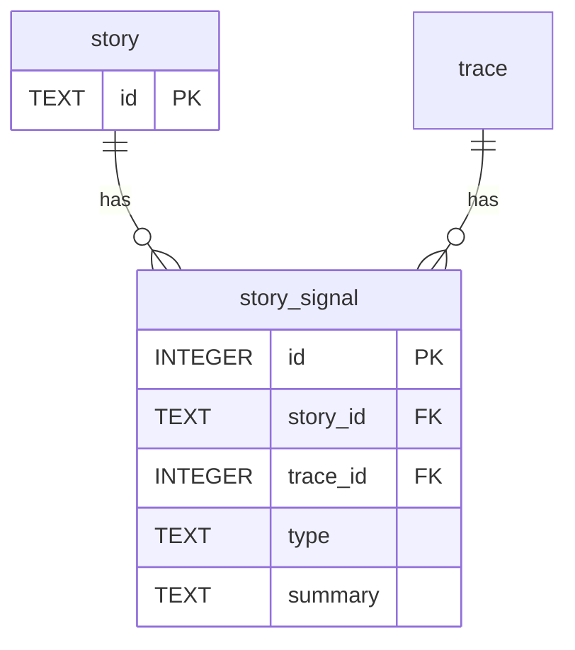

# D5 Data-model delta — US-XXX Story title

Story: US-XXX
Kind: data-model
Source: hand
Scope: tables touched by migration NNN and their foreign-key neighbours
Status: draft
Reviewed-by: -
Reviewed-at: -

## What to review

- Is any data deleted, rewritten, or retained differently? (hard gate)
- Is the migration additive, and is backfill needed?
- Do the constraints match the D4 state set, if one exists?

## Derived next steps

- Migration file and schema-version bump.
- Rebuild-determinism check (two rebuilds print the same dump hash) if any table is rewritten.
