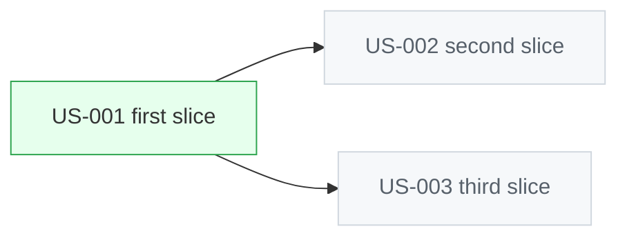

# D6 Story DAG — spec:<slug> or initiative title

Story: spec:<slug>
Kind: story-dag
Source: hand
Scope: stories of <initiative> and their dependencies
Status: draft
Reviewed-by: -
Reviewed-at: -

## What to review

- Is the slicing right — is each node one bounded story?
- Does `A --> B` really mean B cannot start before A ships?
- Is there a cycle? (must be acyclic)

## Derived next steps

- Execution order and which stories can run in parallel.
- The single "ready" story named in the implementation handoff.
- Story hierarchy / dependency records in the durable layer.
