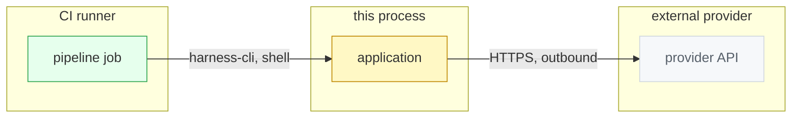

# D7 Boundary — US-XXX Story title

Story: US-XXX
Kind: boundary
Source: hand
Scope: process, provider, and platform boundaries this story crosses
Status: draft
Reviewed-by: -
Reviewed-at: -

## What to review

- Does any crossing edge change an external provider contract? (hard gate)
- Is every crossing labelled with protocol and direction?
- Which boundary needs a deterministic fixture or stub for proof?

## Derived next steps

- Fixture / stub list in `validation.md`.
- Observability point per crossing edge in `design.md`.
